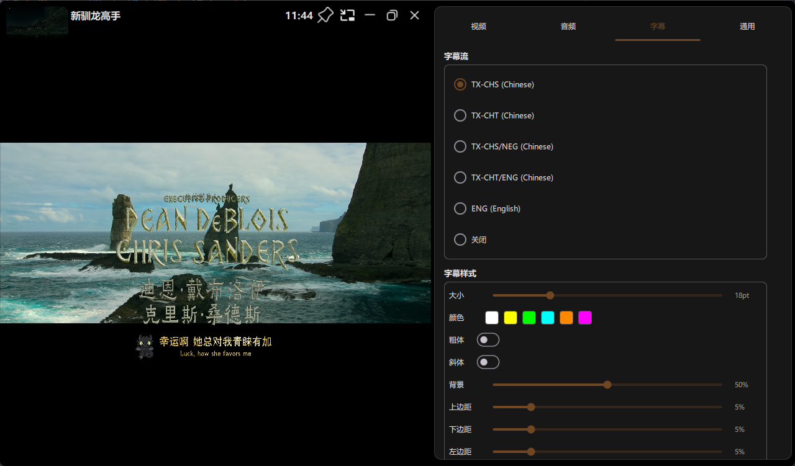
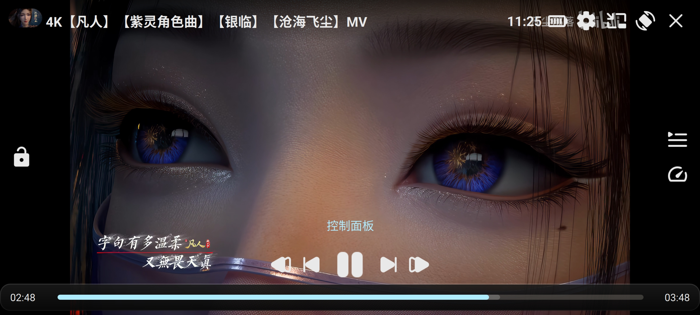

# qzPlayer

基于 Qt 6 / C++23 / FFmpeg 的跨平台多媒体播放器，支持 Windows 和 Android。

## 项目结构

```
├── multimedia/          # qzMultimedia - 多媒体核心库 (FFmpeg 插件、音频、视频)
├── player/              # qzPlayer - 播放器 UI 库 (QML 模块)
├── Controls/md3/        # Md3Controls - Material Design 3 控件库
├── qzTheme/             # qzTheme - 主题系统库
├── qzLog/               # qzLog - 日志库 (spdlog + fmt, C++20 module)
├── examples/            # 示例应用 (qzPlayerExample)
├── cmake/               # CMake 工具函数
└── CMakeUserPresets.json # 构建预设配置
```

## UI 预览

### 桌面端




### 移动端




## 技术栈

| 项目     | 版本 / 说明                                                |
| ------ | ------------------------------------------------------ |
| CMake  | 4.2.1+                                                 |
| C++    | C++23, 含 C++20 Modules (.cppm)                         |
| Qt     | 6.11.1 (Quick, Core, Gui, Network, Concurrent)         |
| FFmpeg | 8.0.2 (avformat, avcodec, avutil, swresample, swscale) |
| 构建工具   | Ninja + LLVM-MinGW (Windows), NDK 28.1 (Android)       |
| Vulkan | 1.4 (可选, 用于硬件加速视频解码)                                   |
| 日志     | spdlog 1.17.0 + fmt 12.1.0                             |

## 平台支持

| 平台      | ABI       | 音频后端               | 视频硬件加速          |
| ------- | --------- | ------------------ | --------------- |
| Windows | x86\_64   | WASAPI + PortAudio | D3D11VA, Vulkan |
| Android | arm64-v8a | AAudio             | Vulkan          |
| Android | x86\_64   | AAudio             | Vulkan          |

## 构建

### 前置条件

- **Qt 6.11.1** - 安装对应平台的 Qt 模块
- **LLVM-MinGW** - Windows 编译器
- **Vulkan SDK** - 硬件加速视频解码
- **FFmpeg 8.0.2** 预编译库 - 放置于 `multimedia/src/3rdparty/ffmpeg/`
- **JDK 17** - Android 构建所需

### Windows (LLVM-MinGW)

```powershell
# Debug 构建
cmake --preset llvm-mingw-debug
cmake --build --preset llvm-mingw-debug -j 8

# Release 构建
cmake --preset llvm-mingw-release
cmake --build --preset llvm-mingw-release -j 8
```

或使用脚本:

```powershell
.\build_windows.ps1        # Debug 增量构建
```

### Android (arm64-v8a)

```powershell
# Release 构建 + 生成 APK
.\build_arm64-v8a_apk.ps1

# 清除缓存重新构建
.\build_arm64-v8a_apk.ps1 -Clean
```

或手动步骤:

```powershell
cmake --preset android-arm64-release
cmake --build --preset android-arm64-release -j 8
```

## QML 模块

| 模块 URI            | 库                 | 说明                                  |
| ----------------- | ----------------- | ----------------------------------- |
| `qz.player`       | qzPlayer          | 播放器窗口、控件、播放列表                       |
| `qz.theme`        | qzTheme           | 主题系统 (平台感知)                         |
| `qz.controls.md3` | Md3Controls       | MD3 风格控件 (Button, Slider, Switch 等) |
| `qz.multimedia`   | qzMultimediaQuick | 多媒体 QML 绑定                          |

## 核心模块说明

### qzMultimedia

多媒体核心库，封装 FFmpeg 实现跨平台音视频播放。包含:

- **音频**: AudioInput / AudioOutput / AudioSink / AudioSource / AudioSpectrumAnalyzer
- **视频**: VideoSink / VideoFrame / VideoFrameFormat
- **播放**: MediaPlayer / PlaybackOptions / PreviewFrameProvider
- **平台**: WASAPI (Windows), AAudio (Android), FFmpeg 插件

### qzPlayer

播放器 UI 库，基于 QML 构建。支持:

- 桌面端 (PlayerWindow + QWindowKit 无边框窗口)
- 移动端 (PlayerWindow 移动适配)
- 播放列表、章节跳转、迷你模式、通知栏
- Vulkan 着色器 (圆角图片渲染)

### qzTheme

平台感知的主题系统，为 Windows / Android / Linux 提供不同的后端实现。

### qzLog

基于 C++20 Module 的日志库，封装 spdlog，支持 fmt 格式化。

## 第三方依赖

| 库                   | 版本      | 许可证           | 用途            |
| ------------------- | ------- | ------------- | ------------- |
| lunasvg             | 3.5.0   | MIT           | SVG 渲染        |
| QWindowKit          | 1.5.0   | Apache-2.0    | Windows 无边框窗口 |
| kissfft             | 131.2.0 | BSD-3-Clause  | FFT (音频频谱分析)  |
| signalsmith-stretch | -       | MIT           | 音频重采样         |
| tlsf                | -       | BSD-2-Clause  | 内存分配器 (TLSF)  |
| fmt                 | 12.1.0  | MIT           | 格式化库          |
| spdlog              | 1.17.0  | MIT           | 日志库           |

完整第三方许可证详情见 [THIRD_PARTY_LICENSES.md](THIRD_PARTY_LICENSES.md)。

## License

[MIT License](LICENSE)

本项目使用了 Apache 2.0 许可的 QWindowKit 库，分发时需保留相关版权声明。详见 [THIRD_PARTY_LICENSES.md](THIRD_PARTY_LICENSES.md)。
